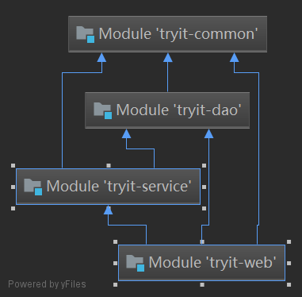

# tryit

使用SSM搭建的后台用户管理系统

## 项目结构

| tryit         |              |
| :------------ | ------------ |
| tryit-common  | 公共工具层   |
| tryit-dao     | DAO接口层    |
| tryit-service | 服务层       |
| tryit-web     | 视图和控制层 |

## 层级依赖关系

